<a href="https://github.com/aktmdtkd/aktmdtkd/">
  </img>
</a>

  

C/C++과 ROS2를 사용하여 로봇 경로 계획을 메인으로 연구하는 대학원생 입니다.

## Developer for Fun

<table align="center">
  <tr>
    <td align="center" width="50%">
      </img>
    </td>
    <td align="center" width="50%">
      </img>
      <tr>
    </td>
  </tr>
  <tr>
    <td  align="center" width="50%">
      <!-- </img> -->
      <!-- </img> -->
      </img>
    </td>
    <td  align="center" width="50%">
      <b>Code Inventory (Byte Size %)</b> 
      
    </td>
  </tr>
  <tr>
    <td align="center" colspan="2">
      </img>
    </td>
  </tr>
  <tr>
    <td align="center" colspan="2">
      </img>
    </td>
  </tr>
  <tr>
    <td align="center" colspan="2">
       </img>
    </td>
  </tr>
  <tr>
    <td align="center" colspan="2">
      <!-- img src=".github/src/metrics.plugin.skyline.svg" alt="Skyline Current Year" width="60%"></img -->
      

Full history
</img>

    </td>
  </tr>
</table>
